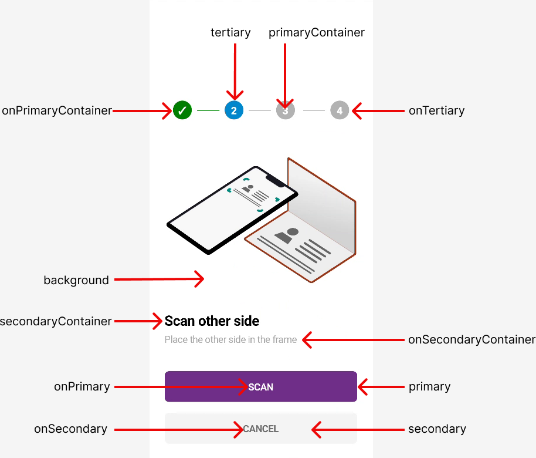
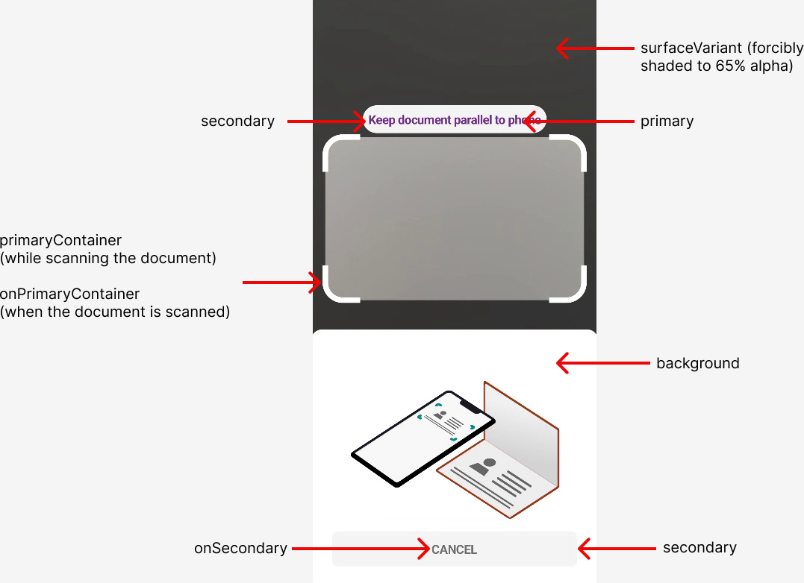
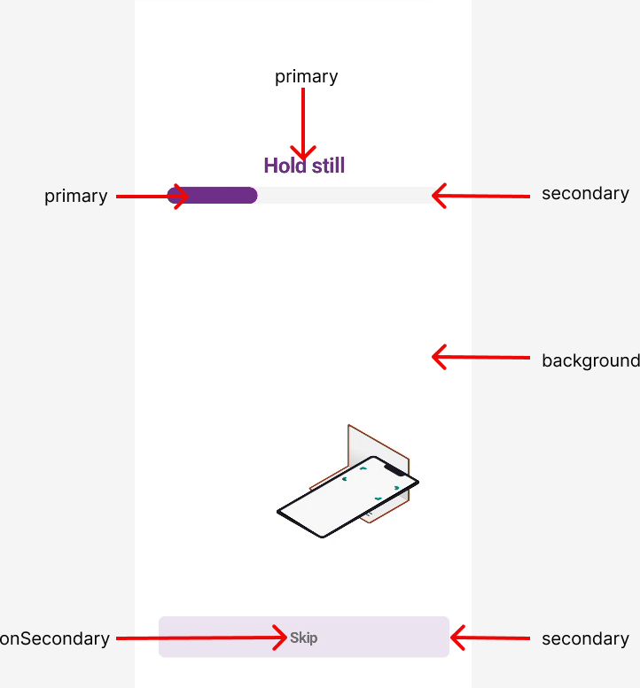
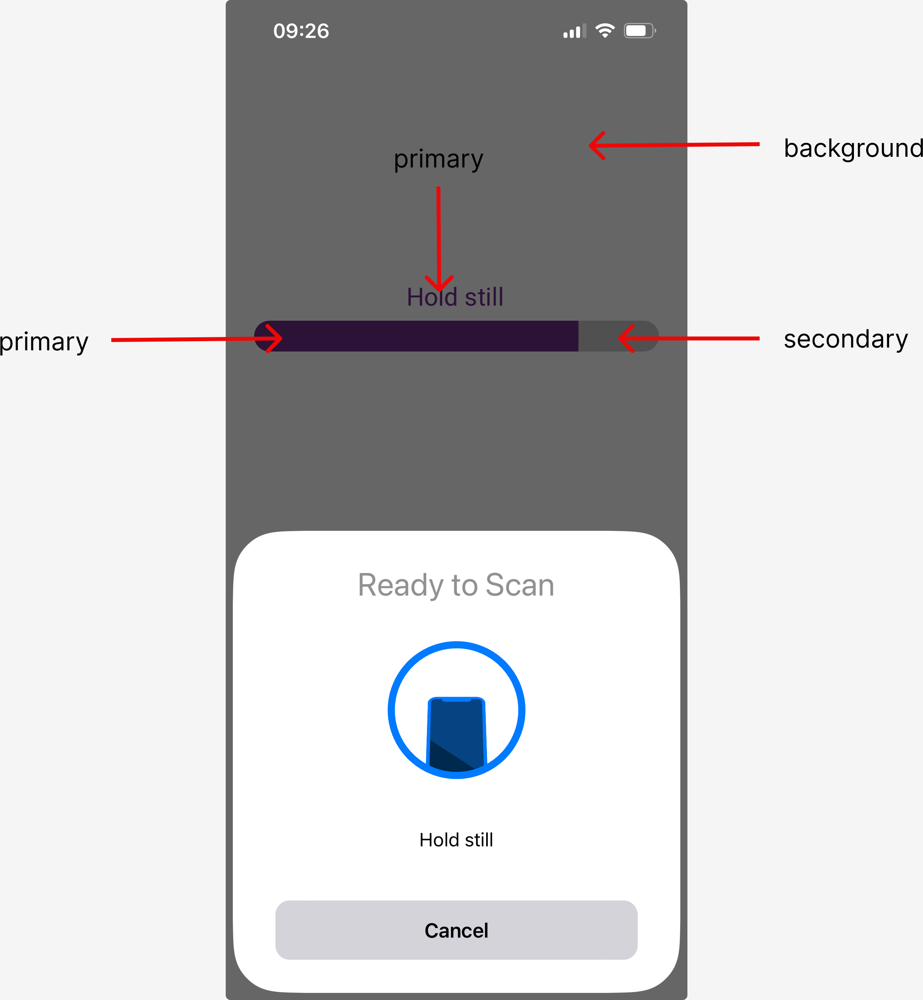
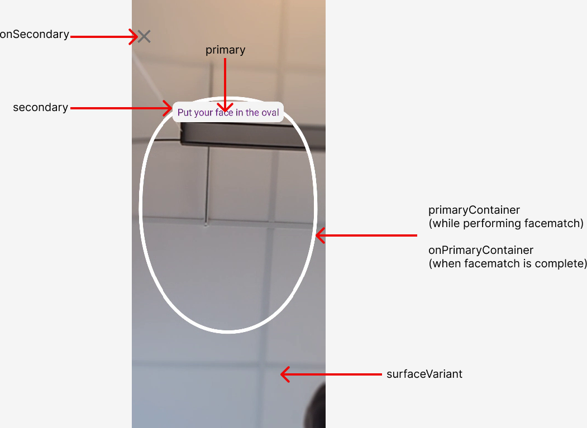
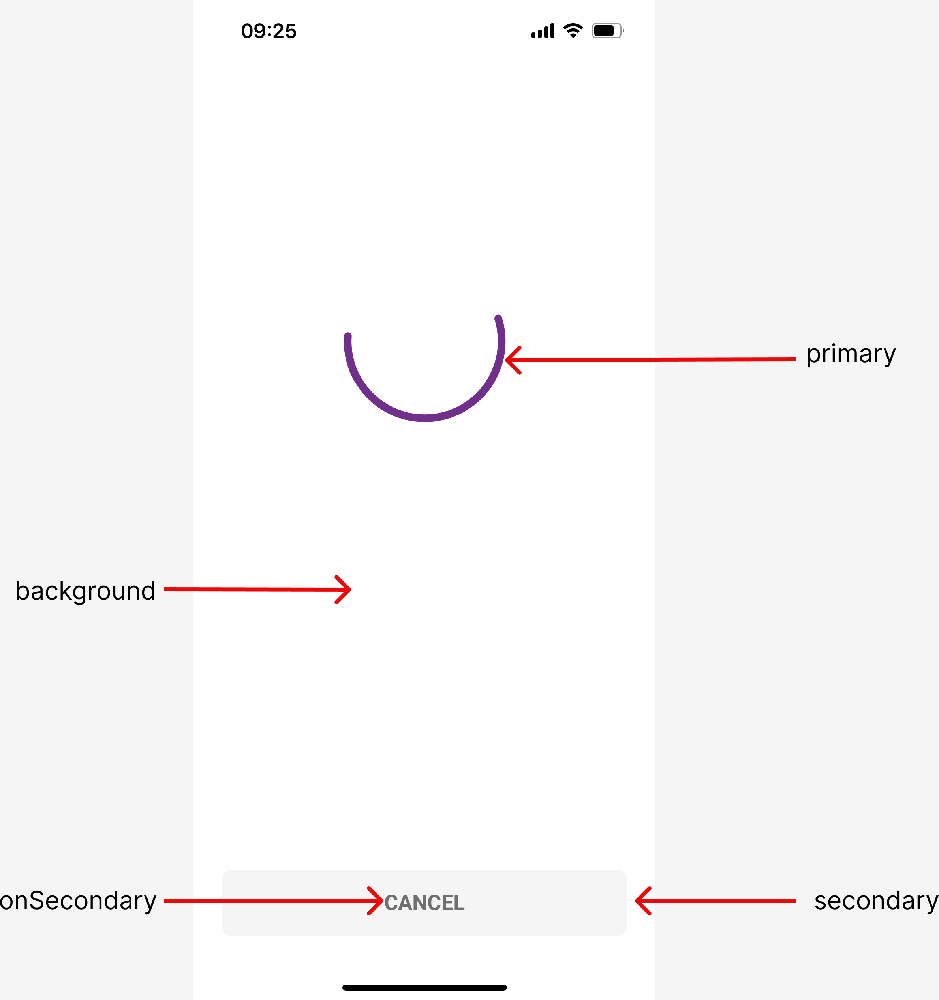

### Custom Theme
 
You can use `IdVerification.setCustomTheme()` to apply a specific set of colors.  
Most of the parameters of this function are optional (except `poweredByLogo` and `showAppBar`), so you can use only those that suits you. Below you see an example of how you can use this function:

```kotlin
setCustomTheme(
    theme = IdVerificationTheme(
        primary = Color.Purple,
        background = Color.White,
        onPrimary = Color.White,
        secondary = Color.White,
        onSecondary = Color.Purple,
        surface = Color.White,
        onSurface = Color.Purple,
        surfaceVariant = Color.Black,
        primaryContainer = Color.White,
        onPrimaryContainer = Color.Green,
        secondaryContainer = Color.LightGray,
        onSecondaryContainer = Color.DarkGray,
        tertiary = Color.Blue,
        onTertiary = Color.MiddleGray,
        poweredByLogo = PoweredByLogo.BLACK,
        appBarLogo = R.drawable.MyAppbarLogo,
        animations = Animations(),
    )
)
```

or alternately, if using Material Design 3 you can provide the desired color palette directly:
```kotlin
setCustomTheme(
    theme = IdVerificationTheme(
        colorScheme = myColorPalette,
        poweredByLogo = PoweredByLogo.BLACK,
        appBarLogo = R.drawable.MyAppbarLogo,
    )
)
```

Below you will find images showing which color variables are applied to certain elements in the SDK.
<br/>

## Information View


## Camera View


## NFC view (android)


## NFC view (iOS)


## iProov view


## Wait view
  

<br/>

You can use `Animations()` to set custom animations for preparation, loading and instructions.
```kotlin
Animations(
    prepareid3
    prepareId1Frontside
    prepareId1Backside
    prepareDocument
    prepareNfc
    prepareFacematch
    instructionId3
    instructionId1Frontside
    instructionId1Backside
    instructionDocument
    instructionNfc
    loadingImageCapture
    loadingNfc
    loadingFacematch
    loadingGeneric
)
```

- The prepare animations are shown before the step is to be performed.
- The instruction animations are shown during the step.
- The loading animations are shown after the step is performed.  

<br/>

Here is an example of how to override the default animations, in this case by replacing a few of them with `ExampleLoadingSpinner()`.  
You can try this out in the [example project](example).
```kotlin
val theme = IdVerification.IdVerificationTheme(
            animations = IdVerification.Animations(
                prepareId3 = { ExampleLoadingSpinner() },
                loadingGeneric = { ExampleLoadingSpinner() },
                loadingImageCapture = { ExampleLoadingSpinner() }
            )
        )
        IdVerification.setCustomTheme(theme)
```
