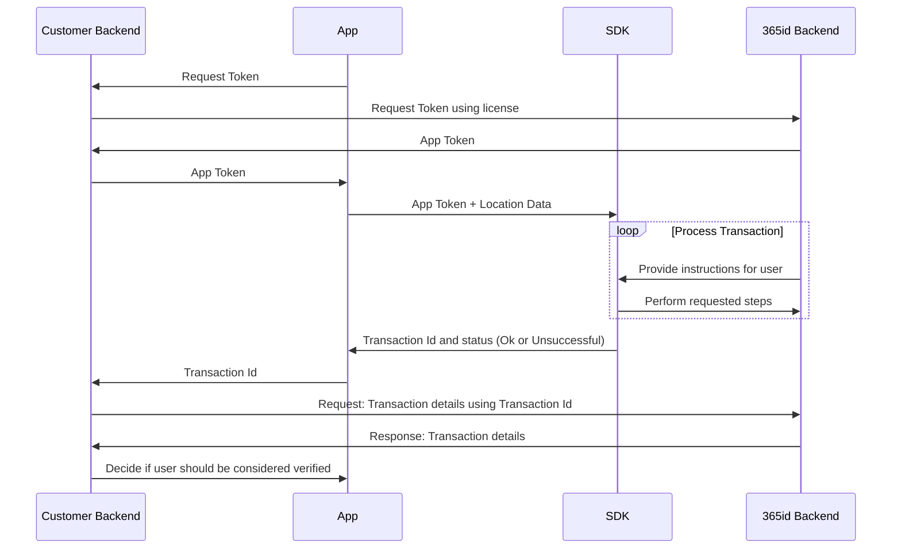

# 365id Id Verification Android SDK 1.0.7

## Table of contents
 - [Introduction](#introduction)
 - [Requirements](#requirements)
 - [Registration](#registration)
 - [Installation](#installation)
 - [Get started](#get-started)
 - [Sample project](#sample-project)
 - [Production](#production)
 - [Help & support](#help--support)


<br/>
<br/>
<br/>


## Introduction

The 365id Id Verification SDK enables you to integrate 365id services into your android app. We also support [iOS](https://github.com/365id-AB/idverification-ios).  

The SDK supports identifying and validating ID documents such as passports, ID cards and drivers' licenses, as well as reading the text on the document and automatically mapping these to relevant fields when used in conjunction with [365id Integration Service](https://365id.com/integrations/?lang=en).


<br/>
<br/>
<br/>

## Requirements

- Android API level 24 (Android 7.0) and above
- Compilation target 31+
- AndroidX


<br/>
<br/>
<br/>


## Registration
If you are already a customer of 365id then you can request a license key by contacting 365id's support at [support@365id.com](mailto:support@365id.com).

Otherwise you can contact us at [info@365id.com](mailto:info@365id.com) for further information.

When you receive your license key you will also receive a location id to pass to the SDK.


<br/>
<br/>
<br/>


## Installation

The 365id Id Verification SDK is provided from a Maven repository as a AAR library (Android Library Project)

1. Open the `build.gradle` file in your new or existing Android project with which you want to integrate

2. Add the repositories section to your `build.gradle` file:
      ```gradle
    repositories {
        maven {
            name = "365id Maven Repository"
            url = url("https://raw.githubusercontent.com/365id-AB/idverification-android/main/maven/")
        }
        // The 365id Id Verification SDK leverages face matching 
        // technology using iProov (github.com/iProov/android). 
        // No implementation is required in your app to enable 
        // this functionality
        maven {
            name = "iProov Maven Repository"
            url = url("https://raw.githubusercontent.com/iProov/android/master/maven/")
        }
    }
    ```
3. Add the 365id Id Verification SDK to your dependencies in the `build.gradle` file:
      ```gradle
    dependencies {
        implementation "com.id365.idverification:sdk:1.0.7"
    }
    ```

<br/>
<br/>
<br/>

## Get started
In order to use the 365id Id Verification SDK it is necessary to follow these steps


### Retrieve a token

Before being able to use the 365id Id Verification SDK, you will need a JWT token. The way of doing that is to make gRPC call using the [Authentication.proto](./example/protos/src/main/proto/Protos/Authentication.proto) file to the url `https://frontend-device-ag.int.365id.com:5001`.  

1. `AuthenticateRequest` - Requests a JWT token based on a provided license key, Language Code and a Vendor Id.
2. `RefreshTokenRequest` - Requests a refreshed token using the refresh token.

The JWT token is valid for 3 minutes, after that you will have to refresh the token using the provided refresh token. In the [TokenRequester.kt](./example/app/src/main/java/com/id365/exampleapp/TokenRequester.kt) file you can find how the example app retrieves its token using the license key.

> **⚠️ SECURITY NOTICE:**  In a production app, it is recommended that you obtain the JWT token using a server-to-server call. The example app retrieves it directly for the sake of simplicity.

<br/>

### Callback

Register a callback function. The callback function receives a `_365iDResult` object containing the transaction id and status.  

A callback example taken from the example project for kotlin
```kotlin
/**
 * Callback
 */

val transactionId = it.transactionId
val status = it.status

when (status) {

    _365iDResult.StatusType.OK -> {
        // This is returned when a transaction completes successfully 
        // Note: This does not mean the user identity or supplied document is verified, 
        // only that the transaction process itself did not end prematurely.
        // The assessment shows a summary 
        val assessment = it.assessment
        print("Successful result")
    }

    _365iDResult.StatusType.Dismissed -> {
        // This is returned if the user dismisses the SDK view prematurely.
        print("User dismissed SDK")
    }

    _365iDResult.StatusType.ClientException -> {
        // This is returned if the SDK encountered an internal error. Report such 
        // issues to 365id as bugs!
        // We may get a unique message if a client exception happens containing the
        // specific issue. Include it in a bug report.
        val usermessage = it.userMessage
        print("Client has thrown an exception")
    }

    _365iDResult.StatusType.ServerException -> {
        // This is returned if there was an issue talking to 365id Services.
        // Could be a connectivity issue.
        val usermessage = it.userMessage
        // We may get a unique message from the 365id Services when this
        // happens, containing a textual description of the backend issue. It may
        // be a temporary server connection issue, or a bug in our backend.
        print("Server has thrown an exception")
    }

    else ->
        // This should not occur
        print("Not supported status type was returned")

}

// Retrieves the result as a json
result.value = it.asJson()

// Stops the SDK and de-allocates the resources
stopSdk()

// Navigates back to Home view
navController.navigate("Home")
```

> **:exclamation: NOTICE:** It is important that you call the `stopSdk()` in the callback, to clear up allocated resources.

> **:exclamation: NOTICE:** In order to return to the host apps view, you will have to pop the stack to release the Sdk view.  

<br/>

### Launch the SDK

Start the SDK in the app by making a call to `startSdk()` and supplying an `ApplicationContext`,  `_365iDRequest` and a callback function. 

Upon a successful start of the SDK, switch to the SDK View. Depending on your framework there may be different ways of accomplishing this, but for simplicity's sake a helper function `getView` is available in the SDK that gives you the ScannerSdkView as an Android `View`.  

```kotlin
val request = _365iDRequest(token, locationName, locationId)
// Starts the Sdk
if (startSdk(this.applicationContext, request) {
    // Callback
}) {
    // Navigates to the SDK view
    navController.navigate("SDK")
}
```

<br/>

### Validation of result
To validate the result you will have to use an existing or a new integration to 365id Services. The data returned back contains all the extracted fields along with the captured images and the assessment of the document.

Documentation for that integration is not covered here and is only delivered on request, so please contact 365id Support at [support@365id.com](mailto:support@365id.com) for your copy.

> **:exclamation: NOTICE:** The example project does not show how to validate the result from the SDK.

<br/>
<br/>
<br/>


## Sample project

To demonstrate the function of the SDK, have a look at the [example project](example).
### Installation
1. Open the `app` project in Android Studio.
2. Open `MainActivity.kt`.  
  a. Find the variable  `license` and set it to your license key.  
  b. Find the variable `locationId` and set it to your location id.  

> **⚠️ SECURITY NOTICE:**  The example app uses the license key to directly fetch tokens from the 365id Backend. This is inherently insecure. We strongly recommend for a production environment to perform this step with a server-to-server call.


<br/>
<br/>
<br/>

## Production

To implement the SDK inside your app, we recommend an implementation that follows this diagram:



In writing, this can be described as such:

- App requests a token. This can be handled either by the app directly, or as recommended by the diagram, through your backend services. Requesting the first token requires a license key. Our recommendation is to store this in your backend, and use it when requesting an app token for the first time. Subsequent tokens for a specific device can be requested using the existing token and a refresh token.
- App uses the received token to start the SDK, beginning a transaction. The SDK will take over the app until all requested steps have been completed, after which it'll return a summary of the transaction result, alongside a transaction ID.
- The transaction ID is used to poll 365id services about the details of the transaction. Recommendation here is that your backend receives this ID from the App, then makes a decision based on the result received from the 365id Backend API.


<br/>
<br/>
<br/>


## Help & support

For additional help, please contact [support@365id.com](mailto:support@365id.com).