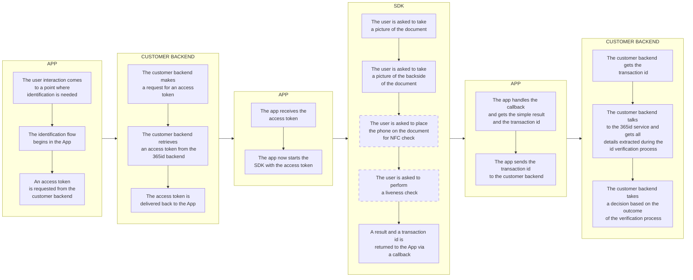
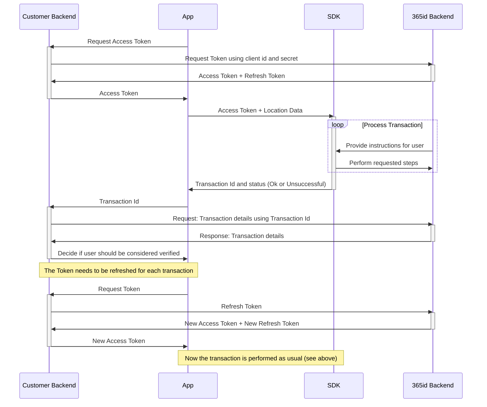

# 365id Id Verification Android SDK


The 365id Id Verification SDK enables you to integrate 365id services into your android app. We also support [iOS](https://github.com/365id-AB/idverification-ios).

The SDK supports identifying and validating ID documents such as passports, ID cards and drivers' licenses, as well as reading the text on the document and automatically mapping these to relevant fields when used in conjunction with the [365id Integration Service](https://365id.com/integrations/?lang=en).


<br/>
<br/>
<br/>


## Registration
If you are already a customer of 365id then you can request sdk credentials by contacting 365id's support at [support@365id.com](mailto:support@365id.com).

Otherwise you can contact us at [info@365id.com](mailto:info@365id.com) for further information.

<br/>
<br/>
<br/>

## Appliation SDK integration flow

This is a basic representation of the flow in an App, integrating the 365id IdVerification SDK with a customer backend.



## Requirements

- Android API level 24 (Android 7.0) and above
- Compilation target 33+
- AndroidX


<br/>
<br/>
<br/>

## Project setup

### Gradle configuration

The 365id IdVerification SDK is provided from a Maven repository as a AAR library (Android Library Project)

1. Open your new or existing Android project with which you want to integrate

2. Add the maven sections to your `settings.gradle` file:
    ```gradle
    dependencyResolutionManagement {
        repositories {
            maven {
                name = "365id Maven Repository"
                url = url("https://raw.githubusercontent.com/365id-AB/idverification-android/main/maven/")
            }
            // The 365id Id Verification SDK leverages face matching
            // technology using iProov (github.com/iProov/android).
            // No implementation is required in your app to enable
            // this functionality
            maven {
                name = "iProov Maven Repository"
                url = url("https://raw.githubusercontent.com/iProov/android/master/maven/")
            }
        }
    }
    ```
3. Add the 365id IdVerification SDK to your dependencies in the `build.gradle` file:
      ```gradle
    dependencies {
        ...
        implementation "com.id365.idverification:sdk:1.1.7"
    }
    ```

<br/>
<br/>
<br/>

### Declare capabilities

The 365id IdVerification SDK needs access to the camera to perform its' main usecase. Access to the NFC chipset (if present) is also needed for reading certain documents.
These capabilities are already declared by the library, and your app will not need to redeclare these, though you may want to provide a rationale for this use case when integrating.

<br/>
<br/>
<br/>

### Logging and error handling

The 365id IdVerification SDK uses Sentry for logging and error handling.

Currently Sentry does not have support for running more than one instance at a time, or change the DSN during runtime, therefore, when the SDK starts it performs a check to see if an instance of Sentry is already running, and if that is the case it wont run Sentry.

If your app have an instance of Sentry running, the logs will be sent to your Sentry project. If your app does not use Sentry this wont be an issue.

To avoid getting our logs we suggest that your app exits Sentry just before the SDK starts and reinstantiate your Sentry right after the SDK exits.

<br/>
<br/>
<br/>

## Sample Application

Please note there is a [Sample Application](example) written with Kotlin and Jetpack Compose that demonstrates one way of integrating the SDK, available in this repository.

<br/>
<br/>
<br/>

## Get started
In order to use the 365id Id Verification SDK it is necessary to follow the steps below.


### Retrieve a token
Before being able to use the 365id Id Verification SDK, you will need an access token and to get that you will need to make a Rest API call with your client id and secret. If you don't have the credentials, please contact us at [info@365id.com](mailto:info@365id.com). Once you have received the credentials you will be able to request an access token. If the access token has expired you don't have to request a new one, all you have to do is refresh it using the refresh_token endpoint.


**Url**: https://eu.customer.365id.com

---
#### **/api/v1/access_token**
*Used for retrieving a new access token using the client id and secret, also known as customer external id and license key*

POST
Request

*Body - application/json*
```json
{
  "client_id": "string",
  "client_secret": "string"
}
```
Response
| Code | Description |
| ---- | ----------- |
| 200 | Success |

*Body - application/json*
```json
{
  "access_token": "string",
  "token_type": "string",
  "expires_in": 0,
  "refresh_token": "string",
  "scope": "string"
}
```
| Code | Description |
| ---- | ----------- |
| 400 | Bad Request |

*Body - application/json*
```json
{
  "error": "string",
  "error_description": "string"
}
```
----

#### **/api/v1/refresh_token**
*Used for refreshing an already retrieved access token. The access token can be or almost be expired when making this call*

POST
Request

*Header*
| Key | Value |
| ----| ----- |
| Authorization | Bearer \<access_token\> |

*Body - application/json*
```json
{
  "refresh_token": "string"
}
```

Response
| Code | Description |
| ---- | ----------- |
| 200 | Success |

*Body - application/json*
```json
{
  "access_token": "string",
  "token_type": "string",
  "expires_in": 0,
  "refresh_token": "string",
  "scope": "string"
}
```

| Code | Description |
| ---- | ----------- |
| 400 | Bad Request |

*Body - application/json*
```json
{
  "error": "string",
  "error_description": "string"
}
```
---

The access token is valid for a certain amount of time, after that you will have to refresh the access token using the provided refresh token

> **⚠️ SECURITY NOTICE:**  In a production app, it is recommended that you obtain the JWT token using a server-to-server call. The example app retrieves it directly for the sake of simplicity.

<br/>
<br/>

### Call the SDK

With a valid token, you can now start the SDK using the `start()` function. `start` takes 3 parameters: An ApplicationContext, a `_365iDRequest` object containing the Token, vendor ID, and location ID, and an event handler that'll receive callbacks from the SDK. The vendor ID is a unique identifier for the device making the request. In our sample app, we generate a random UUID string. You may want to store this in your app preferences, or find another device-unique value to send instead.

<br/>

#### Implement the `sendIntentToSdk()` function.

Within the `onNewIntent()` function, you need to add support for sending intents to the SDK.
An example taken from the example project for kotlin
```kotlin
override fun onNewIntent(intent: Intent?) {
    super.onNewIntent(intent)
    intent?.let {
        sendIntentToSdk(intent)
    }
}
```

<br/>


### Event Handler

The `eventHandler`parameter is the last parameter to `start()` and will be used throughout a transaction to inform the app of key events, including when the SDK is ready to be displayed (`onStarted`), when a transaction is completed (`transactionFinishedSuccessfully` or `transactionFinishedButFailed`, and `retrievedTransactionId`), as well as various error events or premature closure events that you may want to handle in your app.

Example implementation:
```kotlin
class myEventHandler: IdVerificationEventHandler {

    override fun onStarted() {
        // Here the SDK has finished initializing and you can safely switch view to show the SDK
        popSdkView()
    }

    override fun onClosed() {
        // SDK process is now fully closed and all resources cleaned up. 
        // New transaction can be safely initiated with start() at any point after this callback has triggered
    }

    override fun onCompleted(result: IdVerificationResult) {
        // SDK process finished and you can get the `transactionId` from result.
        // After receiving this callback, you should stop the SDK by calling 'stop()'
    }

    override fun onException(exception: IdVerificationException) {
        // SDK process did not finish successfully. You can read the type and message from exception.
        // After receiving this callback, you should stop the SDK by calling 'stop()'
    }

    override fun onUserDismissed() {
        // SDK process finished because the user dismissed the view, by either pressing the close button or performing a "Back" gesture.
        // After receiving this callback, you should stop the SDK by calling 'stop()'
    }
}
```

### Launch the SDK View

Upon a successful start of the SDK, switch to the SDK View. Depending on your framework there may be different ways of accomplishing this.

#### Jetpack Compose
In a Jetpack Compose `@Composable` you can use `ScannerSdkView()` directly:

```kotlin
val request = _365iDRequest(token)
// Starts the Sdk
if (start(this.applicationContext, request, myEventHandler)) {
    // Navigates to the SDK view
    navController.navigate("SDK")
}

@Composable
fun MainContent() {
    val navController = rememberNavController()
    NavHost(navController = navController, startDestination = "Home") {
        composable("Home") {
            Home(navController)
        }
        composable("SDK") {
            ScannerSdkView()
        }
    }
}
```

#### Java View
For a legacy Android project, we provide a convenience `getView` function that returns the SDK as an Android View.
This view can then be added to your layouts like so:
```java
public class SomeActivity extends AppCompatActivity {
    ActivityMainBinding binding;

    @Override
    protected void onCreate(Bundle savedInstanceState) {
        super.onCreate(savedInstanceState);
        binding = ActivityMainBinding.inflate(getLayoutInflater());
        setContentView(binding.root);
        binding.mainContent.addView(getView(this, null, R.attr.materialThemeOverlay, true));
    }
}
```

<br/>

### Validation of result
To validate the result you will have to use an existing or a new integration with 365id Services. The data returned back contains all the extracted fields along with the captured images and the assessment of the document. The captured data is handled in accordance with GDPR and our official [privacy policy](https://365id.com/privacy-policy/).
The data retention time is configurable in our [Customer Portal](https://365id.com/integrations/), though only within the limits of the GDPR.

Documentation for that integration is not covered here and is only delivered on request, so please contact 365id Support at [support@365id.com](mailto:support@365id.com) for your copy.

> **:exclamation: NOTICE:** The example project does not show how to validate the result from the SDK.

<br/>
<br/>

### Custom Theme

You can use `setCustomTheme()` to apply a specific set of colors.
```kotlin
setCustomTheme(
    theme = IdVerificationTheme(
        primary = Color.Purple,
        background = Color.White,
        onPrimary = Color.White,
        secondary = Color.White,
        onSecondary = Color.Purple,
        surface = Color.White,
        onSurface = Color.Purple,
        secondaryContainer = Color.LightGray,
        onSecondaryContainer = Color.DarkGray,
        poweredByLogo = PoweredByLogo.BLACK,
        appBarLogo = R.drawable.MyAppbarLogo,
    )
)
```
or alternately, if using Material Design 3 you can provide the desired color palette directly:
```kotlin
setCustomTheme(
    theme = IdVerificationTheme(
        colorScheme = myColorPalette,
        poweredByLogo = PoweredByLogo.BLACK,
        appBarLogo = R.drawable.MyAppbarLogo,
    )
)
```

<br/>
<br/>
<br/>


## Run the sample project

To demonstrate the function of the SDK, have a look at the [example project](example).
### Installation
1. Open the `app` project in Android Studio.
2. Open `MainActivity.kt`.
  a. Find the variable `clientSecret` and set it to your client secret key.
  b. Find the variable `clientId` and set it to your client id.

> **⚠️ SECURITY NOTICE:**  The Sample App uses the sdk credentials to directly fetch the access token from the 365id Backend. This is inherently insecure. `This is only done in the purpose of demonstration.` We strongly recommend for a production environment to perform this step with a server-to-server call.

<br/>
<br/>
<br/>

## Production Implementation

To implement the SDK inside your app, we recommend an implementation that follows this diagram:



In writing, this can be described as such:

- App requests an access token. This can be handled either by the app directly, or as recommended by the diagram, through your backend services. Requesting the first access token requires a client id and client secret, also known as customer external id and license key. Our recommendation is to store this in your backend, and use it when requesting an access token for the first time. Subsequent access tokens for a specific device can be requested using the existing access token and a refresh token.
- App uses the received access token to start the SDK, beginning a transaction. The SDK will take over the app until all requested steps have been completed, after which it will return a summary of the transaction result, alongside a transaction ID.
- The transaction ID is used to poll 365id services about the details of the transaction. The recommendation here is that your backend receives this ID from the App, then makes a decision based on the result received from the 365id Backend API.


<br/>
<br/>
<br/>

## API

You can find full API documentation here: [https://365id-ab.github.io/idverification-android](https://365id-ab.github.io/idverification-android)


## Help & support

For additional help, please contact [support@365id.com](mailto:support@365id.com).